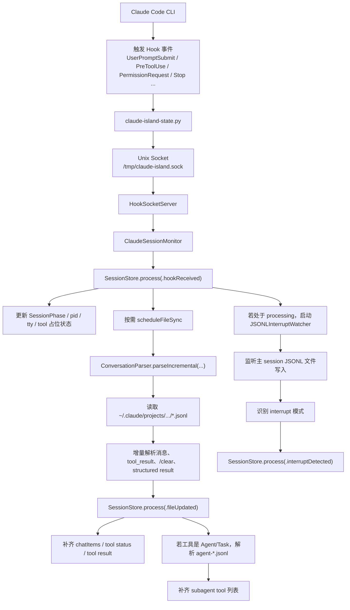
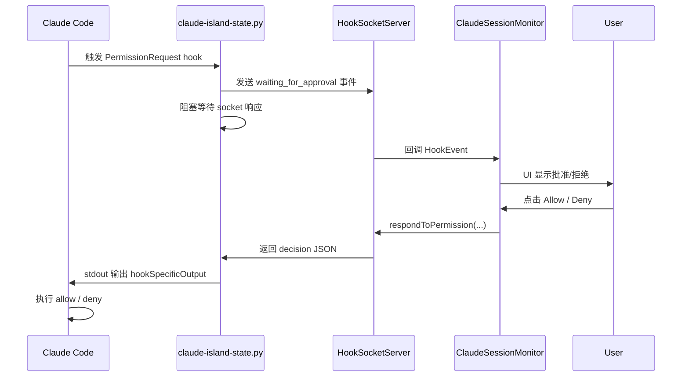
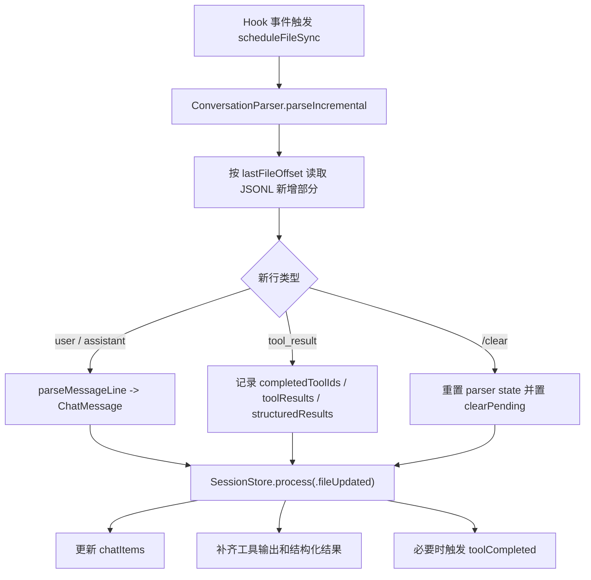
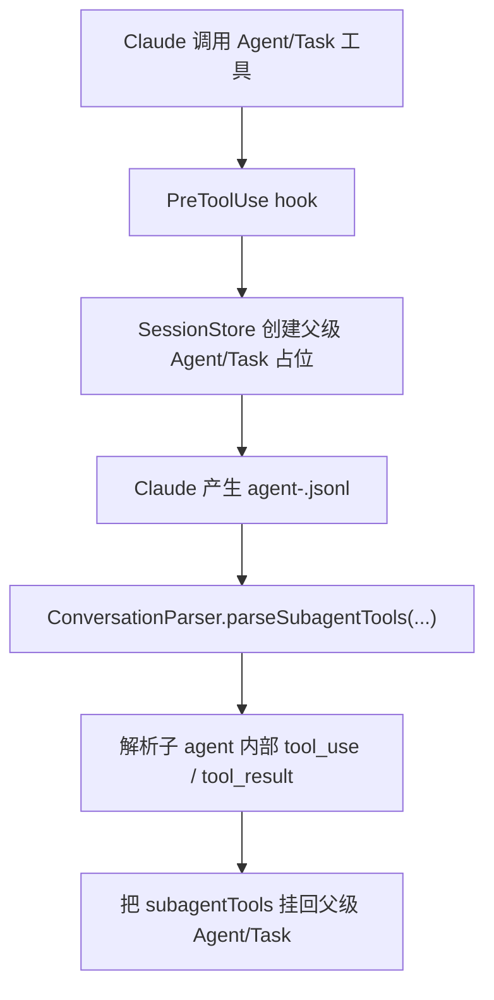

# Claude Island 如何监听 Claude CLI 事件

本文分析 `Claude Island` 是如何感知 `Claude Code CLI` 会话状态、工具调用、权限请求、聊天消息与中断事件的。

结论先说：

- `Claude Island` 的实时事件入口，确实是 **Claude Code hooks**
- 但它 **不只靠 hooks**
- hooks 主要负责把“会话状态变化”实时推给 App
- 聊天内容、工具结果、`/clear`、中断识别、子 agent 工具明细，则大量依赖 **Claude 本地 JSONL 会话文件** 的增量解析与文件监听

也就是说，这个项目采用的是一套“双通路”设计：

- 通路 1：`hooks -> Unix socket -> SessionStore`
- 通路 2：`JSONL files -> ConversationParser / file watchers -> SessionStore`

---

## 1. 总体架构

`Claude Island` 的监听链路可以拆成 5 层：

1. `HookInstaller` 把 Claude hook 注入到 Claude Code 配置
2. hook 脚本 `claude-island-state.py` 在 Claude 事件发生时被 Claude Code 调起
3. 脚本通过 Unix domain socket 把事件发送给 App 内的 `HookSocketServer`
4. `ClaudeSessionMonitor` / `SessionStore` 接收 hook 事件并推进状态机
5. `SessionStore` 再去触发 JSONL 增量同步，补齐消息、工具结果、子 agent 细节

总流程图如下：

---

## 2. hooks 是怎么装进去的

入口在 [HookInstaller.swift](/Users/robertshaw/GitHub/MacApp/claude-island/ClaudeIsland/Services/Hooks/HookInstaller.swift)。

`HookInstaller.installIfNeeded()` 做了两件事：

1. 把打包进 App 的 `claude-island-state.py` 复制到 Claude hooks 目录
2. 修改 Claude 的 `settings.json`，把多个 hook 事件都挂上这个脚本

关键点：

- hook 脚本路径来自 `ClaudePaths.hookScriptShellPath`
- 配置写入目标是 `ClaudePaths.settingsFile`
- 它不是只注册一个事件，而是注册了一组 Claude Code hook

当前安装的事件包括：

- `UserPromptSubmit`
- `PreToolUse`
- `PostToolUse`
- `PostToolUseFailure`
- `PermissionRequest`
- `PermissionDenied`
- `Notification`
- `Stop`
- `StopFailure`
- `SubagentStart`
- `SubagentStop`
- `SessionStart`
- `SessionEnd`
- `PreCompact`
- `PostCompact`

这说明答案里“是不是通过 hooks”这一点可以明确回答：**是，而且 hooks 是主入口。**

但只看这里还不够，因为这一步只能解释“状态事件怎么进 App”，还不能解释“聊天消息和工具结果怎么显示出来”。

---

## 3. hook 脚本如何把事件发给 App

实现位于 [claude-island-state.py](/Users/robertshaw/GitHub/MacApp/claude-island/ClaudeIsland/Resources/claude-island-state.py)。

这个脚本会从 `stdin` 读取 Claude Code 传给 hook 的 JSON，然后组装出自己的 `state`：

- `session_id`
- `cwd`
- `event`
- `pid`
- `tty`
- `tool`
- `tool_input`
- `tool_use_id`
- `notification_type`
- `message`

然后通过 Unix socket 发往：

- `/tmp/claude-island.sock`

这一层不是直接写文件、也不是轮询 CLI 进程，而是：

- **Claude Code 触发 hook**
- **hook 脚本主动连接 App 的本地 socket**
- **App 即时收到事件**

### hook 里的状态映射

脚本还会把 Claude hook 事件先映射成更适合 UI 的状态：

- `UserPromptSubmit -> processing`
- `PreToolUse -> running_tool`
- `PostToolUse -> processing`
- `PermissionRequest -> waiting_for_approval`
- `Notification(idle_prompt) -> waiting_for_input`
- `Stop -> waiting_for_input`
- `SessionEnd -> ended`
- `PreCompact -> compacting`

所以，hook 层负责的是“**把 Claude 原始事件翻译成 App 能消费的状态事件**”。

---

## 4. App 端如何接收 hook 事件

接收端在 [HookSocketServer.swift](/Users/robertshaw/GitHub/MacApp/claude-island/ClaudeIsland/Services/Hooks/HookSocketServer.swift)。

`HookSocketServer` 做的事情：

- 在 `/tmp/claude-island.sock` 上启动 Unix domain socket server
- 接收 hook 脚本发来的 JSON
- 解码成 `HookEvent`
- 回调给上层

`HookEvent` 是实时事件的统一结构，字段包括：

- `sessionId`
- `cwd`
- `event`
- `status`
- `pid`
- `tty`
- `tool`
- `toolInput`
- `toolUseId`

同时它支持一个很关键的能力：**权限请求的同步应答**。

当事件是 `PermissionRequest` 时：

- hook 脚本会阻塞等待 socket 响应
- App 端保留该 socket
- 用户点击允许/拒绝后，App 再把决策写回去
- hook 脚本把 Claude 需要的 JSON 输出到 stdout

也就是说，权限审批不是 UI 层“看到了一个状态”，而是真的通过 hook-response 协议控制了 Claude Code 的行为。

权限流如下：

---

## 5. `ClaudeSessionMonitor` 如何把 hook 接到状态机

入口在 [ClaudeSessionMonitor.swift](/Users/robertshaw/GitHub/MacApp/claude-island/ClaudeIsland/Services/Session/ClaudeSessionMonitor.swift)。

`startMonitoring()` 里做了三件关键事：

1. 启动 `HookSocketServer`
2. 收到事件后调用 `SessionStore.shared.process(.hookReceived(event))`
3. 对 processing 状态额外启动 `InterruptWatcherManager`

这说明 `ClaudeSessionMonitor` 更像一个桥接层：

- 下游连着 socket/hook
- 上游连着 `SessionStore`
- 顺手管理中断 watcher 和权限失败回调

这里已经可以看出项目设计思想：

- **hooks 负责“立即知道发生了什么”**
- **SessionStore 负责“决定状态怎么变”**
- **JSONL 负责“补齐事件细节和最终结果”**

---

## 6. `SessionStore` 是状态汇聚中心

核心文件是 [SessionStore.swift](/Users/robertshaw/GitHub/MacApp/claude-island/ClaudeIsland/Services/State/SessionStore.swift)。

这个 actor 是全项目的单一状态入口：

- 所有会话状态变化都走 `process(_ event: SessionEvent)`
- hook 事件、文件事件、权限事件、中断事件都会汇总到这里

### 6.1 hook 事件进入后的处理

`processHookEvent(_:)` 主要做这些事：

- 如果 session 不存在，就创建 `SessionState`
- 更新 `pid`、`tty`、`lastActivity`
- 根据 `HookEvent.determinePhase()` 推进 `SessionPhase`
- 对 `PreToolUse` 创建工具占位项
- 对 `PermissionRequest` 标记工具为等待审批
- 对 `Stop` 清理 subagent tracking
- 对需要同步文件的事件触发 `scheduleFileSync`

这里有个很重要的判断：

- `UserPromptSubmit`
- `PreToolUse`
- `PostToolUse`
- `Stop`

这些事件会触发 `shouldSyncFile == true`

也就是说，hooks 本身并不携带完整聊天记录，而是把“该去同步 JSONL 了”这个时机告诉 `SessionStore`。

### 6.2 会话状态机

状态定义在 [SessionPhase.swift](/Users/robertshaw/GitHub/MacApp/claude-island/ClaudeIsland/Models/SessionPhase.swift)：

- `idle`
- `processing`
- `waitingForInput`
- `waitingForApproval`
- `compacting`
- `ended`

`HookEvent.determinePhase()` 会把 hook 事件映射到这些状态。

这就是为什么 UI 可以在很早的时候就显示“Claude 正在运行工具”或“正在等你批准”:

- 不是等 JSONL 完整落盘后才知道
- 而是 hook 先把 phase 推起来

---

## 7. 为什么还要读 JSONL 文件

答案是：**hook 不够完整。**

hooks 擅长的是“事件通知”，但不适合承担完整会话数据源。项目需要 JSONL 的原因至少有 5 个：

1. 需要拿到完整聊天消息内容
2. 需要拿到 `tool_result` 的真实输出
3. 需要识别 `/clear`
4. 需要恢复历史聊天
5. 需要读取 subagent 独立 JSONL 文件

这一部分由 [ConversationParser.swift](/Users/robertshaw/GitHub/MacApp/claude-island/ClaudeIsland/Services/Session/ConversationParser.swift) 完成。

---

## 8. JSONL 增量同步是如何工作的

### 8.1 触发时机

`SessionStore.scheduleFileSync(sessionId:cwd:)` 会在 hook 事件后做一个 `100ms` debounce，然后调用：

- `ConversationParser.parseIncremental(sessionId:cwd:)`

### 8.2 解析内容

`parseIncremental()` 内部维护一份 `IncrementalParseState`，包括：

- `lastFileOffset`
- `messages`
- `seenToolIds`
- `completedToolIds`
- `toolResults`
- `structuredResults`
- `clearPending`

这意味着它不是每次都全量重读，而是：

- 记住上次读到哪
- 只读取新追加的 JSONL 内容

### 8.3 它从 JSONL 提取什么

主要提取 3 类数据：

1. 新消息
2. 工具完成结果
3. 特殊控制事件

细分如下：

- `user` / `assistant` 行 -> 解析成 `ChatMessage`
- `tool_result` -> 记录 `completedToolIds`、`toolResults`、`structuredResults`
- `<command-name>/clear</command-name>` -> 标记清屏

流程图如下：

---

## 9. 工具状态为什么既看 hook 又看 JSONL

这是这个项目设计里最关键的一点。

### hook 负责“开始”

当收到 `PreToolUse` 时，`SessionStore` 会立刻：

- 在 UI 里创建一个 tool placeholder
- 把状态设为 `running`

这样用户可以几乎实时看到“Claude 正在调用某个工具”。

### JSONL 负责“完成结果”

真正 authoritative 的完成信号来自 JSONL 里的 `tool_result`。

在 `processFileUpdate(_:)` 里，项目会：

- 根据 `completedToolIds` 找出已完成工具
- 用 `toolResults` / `structuredResults` 补齐输出
- 进一步派发 `.toolCompleted(...)`

因此可以把工具生命周期理解成：

- `PreToolUse hook` 负责尽快创建 UI 占位
- `tool_result JSONL` 负责确认这个工具真的完成了，以及结果是什么

这也是为什么文档不能简单写成“项目通过 hooks 监听 Claude CLI 事件”就结束，因为真正完整答案是：

- **hooks 监听事件**
- **JSONL 确认内容与结果**

---

## 10. 中断检测并不完全依赖 hooks

中断检测由 [JSONLInterruptWatcher.swift](/Users/robertshaw/GitHub/MacApp/claude-island/ClaudeIsland/Services/Session/JSONLInterruptWatcher.swift) 完成。

`ClaudeSessionMonitor` 在会话进入 `processing` 时会启动 watcher：

- 直接监听该 session 对应的 JSONL 文件
- 使用 `DispatchSource.makeFileSystemObjectSource`
- 关注 `.write` 和 `.extend`

然后在新写入内容里匹配这些模式：

- `Interrupted by user`
- `user doesn't want to proceed`
- `[Request interrupted by user]`
- `"interrupted": true`

检测到后会回调：

- `SessionStore.process(.interruptDetected(sessionId))`

这说明项目作者认为：

- 单靠 hook 对“用户打断”检测不够快或不够稳定
- 所以额外上了一层针对 JSONL 的文件系统事件监听

文件头注释也直接写了：

- `Uses file system events to detect interrupts faster than hook polling`

所以，中断场景是一个明确的“**不是只靠 hooks**”的证据。

---

## 11. 子 agent 细节也不只靠 hooks

对于 `Agent/Task` 工具，hooks 只能知道：

- 子 agent 开始了
- 子 agent 结束了

但子 agent 内部实际调用了哪些工具，详细信息还在它自己的 JSONL 文件里。

相关代码：

- [SessionStore.swift](/Users/robertshaw/GitHub/MacApp/claude-island/ClaudeIsland/Services/State/SessionStore.swift)
- [ConversationParser.swift](/Users/robertshaw/GitHub/MacApp/claude-island/ClaudeIsland/Services/Session/ConversationParser.swift)
- [AgentFileWatcher.swift](/Users/robertshaw/GitHub/MacApp/claude-island/ClaudeIsland/Services/Session/AgentFileWatcher.swift)

### 子 agent 数据源

`ConversationParser.subagentFilePath(...)` 支持两种路径：

- 新版 Claude Code：
  - `projects/<project>/<sessionId>/subagents/agent-<agentId>.jsonl`
- 旧版 Claude Code：
  - `projects/<project>/agent-<agentId>.jsonl`

### 两种补齐方式

项目里对子 agent 有两层处理：

1. hook 层实时跟踪 `SubagentStart` / `SubagentStop`
2. 文件层读取 `agent-*.jsonl`，解析内部 `tool_use` / `tool_result`

所以子 agent 流程可以画成：

---

## 12. 历史聊天是怎么恢复的

首次打开某个会话时，并不是靠 hook 重放历史，而是直接读取 JSONL：

- `SessionStore.process(.loadHistory(...))`
- `ConversationParser.parseFullConversation(...)`
- `process(.historyLoaded(...))`

这说明 JSONL 不只是实时同步的补充，还是：

- **历史恢复的数据源**

如果没有这层，App 只能看到“从启动之后发生的 hook 事件”，无法展示完整聊天。

---

## 13. 回答“是不是通过 hooks”的准确说法

如果只用一句话概括：

> `Claude Island` 监听 `Claude CLI` 事件的主入口是 Claude Code hooks，但它并不是只靠 hooks；hooks 提供实时状态事件，JSONL 文件解析与文件监听负责补齐消息、工具结果、中断和子 agent 细节。

更具体一点，可以拆成下面这张表：

| 能力 | 主要来源 | 作用 |
| --- | --- | --- |
| 会话开始/结束 | hooks | 实时更新 session 生命周期 |
| 用户发消息 | hooks + JSONL | hook 触发同步，JSONL 提取消息内容 |
| 工具开始 | hooks | 立即显示 tool placeholder |
| 工具完成 | JSONL `tool_result` | 确认工具完成并拿到结果 |
| 权限请求 | hooks + socket response | 实时审批，直接影响 Claude 行为 |
| 中断检测 | JSONL file watcher | 更快、更稳定地识别 interrupt |
| `/clear` | JSONL | 重置 UI 状态 |
| 子 agent 明细 | agent JSONL | 展示子 agent 内部工具调用 |
| 历史聊天恢复 | JSONL | 全量重建聊天记录 |

---

## 14. 关键代码索引

如果你想顺着代码自己再读一遍，建议按这个顺序：

1. [HookInstaller.swift](/Users/robertshaw/GitHub/MacApp/claude-island/ClaudeIsland/Services/Hooks/HookInstaller.swift)
2. [claude-island-state.py](/Users/robertshaw/GitHub/MacApp/claude-island/ClaudeIsland/Resources/claude-island-state.py)
3. [HookSocketServer.swift](/Users/robertshaw/GitHub/MacApp/claude-island/ClaudeIsland/Services/Hooks/HookSocketServer.swift)
4. [ClaudeSessionMonitor.swift](/Users/robertshaw/GitHub/MacApp/claude-island/ClaudeIsland/Services/Session/ClaudeSessionMonitor.swift)
5. [SessionEvent.swift](/Users/robertshaw/GitHub/MacApp/claude-island/ClaudeIsland/Models/SessionEvent.swift)
6. [SessionPhase.swift](/Users/robertshaw/GitHub/MacApp/claude-island/ClaudeIsland/Models/SessionPhase.swift)
7. [SessionStore.swift](/Users/robertshaw/GitHub/MacApp/claude-island/ClaudeIsland/Services/State/SessionStore.swift)
8. [ConversationParser.swift](/Users/robertshaw/GitHub/MacApp/claude-island/ClaudeIsland/Services/Session/ConversationParser.swift)
9. [JSONLInterruptWatcher.swift](/Users/robertshaw/GitHub/MacApp/claude-island/ClaudeIsland/Services/Session/JSONLInterruptWatcher.swift)
10. [AgentFileWatcher.swift](/Users/robertshaw/GitHub/MacApp/claude-island/ClaudeIsland/Services/Session/AgentFileWatcher.swift)

---

## 15. 最终结论

这个项目对 Claude CLI 的监听机制，本质上是：

- **用 hooks 拿实时事件**
- **用 socket 把事件送进 App**
- **用 SessionStore 做统一状态机**
- **用 JSONL 增量解析补齐消息和工具结果**
- **用文件系统 watcher 处理 interrupt 和子 agent 文件变化**

所以答案不是“通过 hooks”或者“不是通过 hooks”二选一，而是：

- **是通过 hooks 起步**
- **但完整监听能力是 hooks + JSONL + file watcher 的组合方案**

