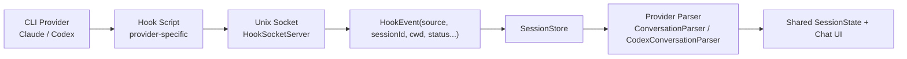
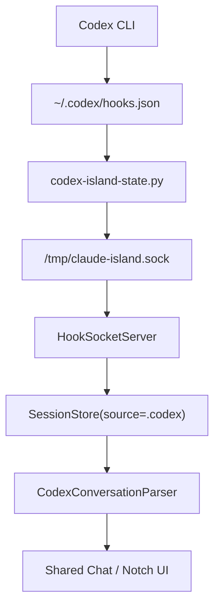
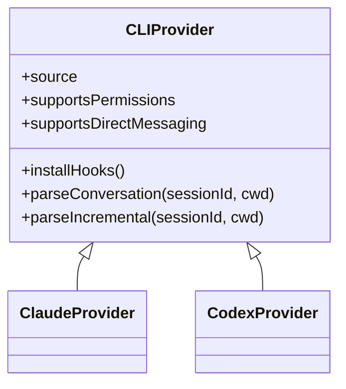

# Multi-CLI Island Architecture

本文描述当前项目如何从“只支持 Claude CLI”演进为“支持多个 CLI provider 的 island”，以及这次接入 `Codex CLI` 采用的实现方式。

## 结论

当前代码已经具备一个可扩展的多 CLI 雏形：

- 会话模型层新增了 `SessionSource`
- hook 入口支持按 `source` 区分事件来源
- `SessionStore` 会根据 `source` 走不同的解析和同步逻辑
- `HookInstaller` 会分别安装 Claude / Codex 对应的 hook
- UI 层已经能在列表和聊天头部展示不同 CLI 的来源标签

也就是说，项目现在不再是“只能理解 Claude 的单协议 app”，而是一个有了 `provider adapter` 方向的 island。

## 当前抽象

核心思路是：

1. 每个 CLI 自己负责把原始事件转换成统一的 hook payload
2. 中间传输层只关心统一字段，不关心 provider 私有格式
3. `SessionStore` 根据 `SessionSource` 决定后续用哪个 parser / watcher / 能力集

## 这次新增的关键点

### 1. 会话来源建模

文件：

- [SessionSource.swift](/Users/robertshaw/GitHub/MacApp/claude-island/ClaudeIsland/Models/SessionSource.swift)
- [SessionState.swift](/Users/robertshaw/GitHub/MacApp/claude-island/ClaudeIsland/Models/SessionState.swift)

`SessionState` 新增 `source` 字段，解决了一个核心问题：

- 同一个 UI 列表里，可以并排展示来自不同 CLI 的会话
- 同一个状态机里，可以根据来源决定能力是否可用
- 同一个聊天页里，可以根据来源决定是否允许主动发消息、是否支持权限审批

### 2. Hook 接入变成 provider-specific

文件：

- [HookInstaller.swift](/Users/robertshaw/GitHub/MacApp/claude-island/ClaudeIsland/Services/Hooks/HookInstaller.swift)
- [claude-island-state.py](/Users/robertshaw/GitHub/MacApp/claude-island/ClaudeIsland/Resources/claude-island-state.py)
- [codex-island-state.py](/Users/robertshaw/GitHub/MacApp/claude-island/ClaudeIsland/Resources/codex-island-state.py)

当前做法不是试图写一个“万能 hook 脚本”，而是：

- Claude 用自己的 hook 脚本
- Codex 用自己的 hook 脚本
- 两者都发送到同一个 Unix socket
- 统一 payload 中带上 `source`

这是一种更稳的做法，因为不同 CLI 的 hook 协议、事件名、stdin payload 并不相同。

## Codex 的落地方式

这次 Codex 接入主要利用了两类数据源：

- hook 事件：`SessionStart` / `UserPromptSubmit` / `Stop`
- 历史文件：`~/.codex/sessions/.../*.jsonl` 与 `session_index.jsonl`

其中：

- hook 负责会话启动、处理中、停止等实时状态
- JSONL 负责补齐消息正文、工具调用、工具结果、标题

## 和 Claude 的差异

当前 Claude 支持能力更完整，Codex 暂时是第一版：

| 能力 | Claude | Codex |
|---|---|---|
| 实时 hook 状态 | 支持 | 支持 |
| 消息增量解析 | 支持 | 支持 |
| 工具调用解析 | 支持 | 支持 |
| 工具结构化结果 | 支持 | 暂未接入 |
| 权限审批回写 | 支持 | 暂未接入 |
| `/clear` 检测 | 支持 | 暂未接入 |
| 主动向 CLI 发消息 | 支持 | 暂时只读 |

这不是架构缺陷，而是 provider 能力差异。现在的抽象已经允许“共享 UI，分 provider 能力矩阵”。

## 为什么这条路可扩展

如果未来要继续接入新的 CLI，比如 Gemini CLI / Aider / OpenCode，复用路径会很清晰：

1. 增加一个新的 `SessionSource`
2. 增加 provider 自己的 paths / hook installer / hook script
3. 增加 provider 自己的 conversation parser
4. 在 `SessionStore` 中挂接该 source 的 parse / sync 策略
5. 在 UI 中声明它支持哪些交互能力

这意味着后续新增 provider 时，大多数修改会落在边界层，而不是把现有 Claude 逻辑继续写散。

## 下一步建议

如果要把“多 CLI island”做成正式方向，建议继续往下收敛成真正的 provider 协议层：

优先级建议：

1. 把 `ConversationParser` / `CodexConversationParser` 抽成统一协议
2. 把 `HookInstaller` 拆成 provider installer，而不是继续堆 `installClaudeHooks()` / `installCodexHooks()`
3. 把 UI 文案从 “Claude session” 逐步改成更中性的 “CLI session”
4. 评估 Codex 是否存在可回写的权限/交互协议，再决定是否补齐审批和主动发消息

## 本次实现范围

本次已经完成：

- Codex hook 自动安装
- Codex 会话发现与消息解析
- Codex 工具调用和工具输出展示
- 会话来源标签展示
- 只读能力矩阵接入

本次还没有完成：

- App 正式改名
- provider 协议完全抽象
- Codex 权限审批
- Codex 主动聊天发送
- 更多 CLI provider 的接入

## 结论

这次改造已经把项目从“Claude 专用监听器”推进到了“多 CLI island 的第一阶段”。现在它的骨架已经支持多个 provider 并存，Claude 和 Codex 只是第一组落地样例。
